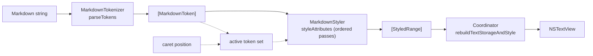

# Architecture

MarkdownEngine is a TextKit 2 backed Markdown editor for macOS, exposed
to SwiftUI through `NativeTextViewWrapper`. The engine has no internal
AST — it tokenizes the text into `NSRange` spans, generates a flat list
of `(range, attributes)` tuples via an ordered pipeline of styling
passes, and applies them to an `NSTextView`. Everything app-specific
(wiki-link IDs, syntax highlighting, embedded images, LaTeX) is provided
by four service protocols you implement, or by the opt-in bridge
products.

## Source layout

```bash
Sources/
├── MarkdownEngine/                          # core target — zero deps
│   ├── Configuration/                       # MarkdownEditorConfiguration + MarkdownEditorTheme
│   ├── Services/                            # 4 protocols, no-op defaults, WikiLinkService
│   ├── Parser/                              # MarkdownTokenizer.swift + emphasis stack parser
│   ├── Styling/                             # MarkdownStyler.swift + one extension per token class
│   ├── Renderer/                            # LayoutBridge, MarkdownTextLayoutFragment, EmbeddedImageCache
│   ├── Input/                               # MarkdownInputHandler + MarkdownListHandler
│   ├── TextView/
│   │   ├── NativeTextViewWrapper.swift      # SwiftUI entry point (NSViewRepresentable)
│   │   ├── NativeTextView/                  # AppKit subclass + UX extensions (paste, drag-select, …)
│   │   └── Coordinator/                     # NSTextViewDelegate split by concern (restyling, find, …)
│   └── MarkdownEngine.docc/                 # DocC catalog
├── MarkdownEngineCodeBlocks/                # opt-in product
│   └── HighlighterSwiftBridge.swift         # SyntaxHighlighter backed by HighlighterSwift
└── MarkdownEngineLatex/                     # opt-in product
    └── SwiftMathBridge.swift                # LatexRenderer backed by SwiftMath
```

The rest of this file is a per-directory tour, in the order text flows
through the engine.

## Pipeline



## [`Parser/`](Sources/MarkdownEngine/Parser): what is a token?

Regex-driven tokenizer. Emphasis (`*`, `**`, `***`) runs through a
separate stack parser in `MarkdownTokenizer+Emphasis.swift` to handle
nesting. Each `MarkdownToken` has a `kind`, a `range`, a `contentRange`,
and `markerRanges` (for `**bold**`, the two `**`).

Token kinds: `italic`, `bold`, `boldItalic`, `link`, `wikiLink`,
`heading`, `codeBlock`, `inlineCode`, `blockLatex`, `inlineLatex`,
`imageEmbed`.

**Invariant:** Tokenization is pure, allocation-light, and cheap enough
to re-run on every keystroke. Tokens are not cached outside
`NativeTextViewCoordinator`, and never mutated after a styling pass.

## [`Services/`](Sources/MarkdownEngine/Services): how does the engine talk to your app?

Four `Sendable` protocols with no-op defaults — embedders implement only
the ones they actually use.

- `WikiLinkResolver` — `[[Name]]` → opaque ID
- `EmbeddedImageProvider` — `![[Name]]` → `NSImage`
- `SyntaxHighlighter` — code → coloured `NSAttributedString`
- `LatexRenderer` — `$…$` / `$$…$$` → `NSImage`

`WikiLinkService.swift` also lives here and handles the dual-form
storage / display transform — storage is `[[Name|<id>]]`, display is
`[[Name]]`. Reference implementations live in the opt-in bridge targets.

**Invariant:** Service callbacks are synchronous. If an embedder's
implementation is slow, it caches (both bundled bridges do); the engine
never async-renders.

**Invariant:** Wiki-link storage and display are different strings.
Display IDs never leak into the binding.

## [`Styling/`](Sources/MarkdownEngine/Styling): how do tokens become attributes?

`MarkdownStyler.styleAttributes()` (`MarkdownStyler.swift:78`) runs an
ordered pipeline of styling passes — headings, emphasis, auto-links,
wiki-links, image embeds, markdown links, code blocks, inline code,
block / inline LaTeX, horizontal rules, incomplete brackets, task
checkboxes, marker-shrinking — each returning `[(range, attributes)]`.
Passes are linear and additive; later passes intentionally clobber
earlier ones (which is why `shrinkInactiveMarkers` runs last).

If the coordinator passes `scopedRanges`, range-based scans only touch
those paragraphs — the optimization that keeps per-keystroke restyling
cheap.

**Invariant:** Markers shrink, they don't disappear. Inactive markers
render at `hiddenMarkerFontSize`; they're never removed from text
storage. Every selection / copy / find / undo bug downstream traces back
to violating this.

## [`Renderer/`](Sources/MarkdownEngine/Renderer): TextKit 2 layout

Thin wrappers around `NSTextLayoutManager` (`LayoutBridge.swift`), a
custom `MarkdownTextLayoutFragment` for precise positioning, and
`EmbeddedImageCache` keyed by an embedder-supplied fingerprint so images
and LaTeX results invalidate when the embedder says so.

## [`Input/`](Sources/MarkdownEngine/Input): typing-time helpers

`MarkdownInputHandler.swift` handles auto-wrap for `$…$` / `$$…$$` /
`![[…]]`. `MarkdownListHandler.swift` handles list continuation,
indent / outdent, and task-checkbox toggling on Enter / Tab / Backspace.
Both run synchronously inside the text-view delegate.

## [`TextView/`](Sources/MarkdownEngine/TextView): NSTextView + SwiftUI bridge

The entry point is `NativeTextViewWrapper.swift` — an
`NSViewRepresentable` that owns the coordinator and the configured text
view. Two sub-folders matter:

- `NativeTextView/` — extensions on the AppKit subclass (paste,
  drag-select boost, spell policy, caret workarounds)
- `Coordinator/` — `NSTextViewDelegate` glue, split by concern
  (restyling, writing-tools, find, code-blocks, inline selection,
  autocorrect)

Application of `[StyledRange]` to text storage happens in
`Coordinator/NativeTextViewCoordinator+Restyling.swift` →
`rebuildTextStorageAndStyle()`.

## [`Configuration/`](Sources/MarkdownEngine/Configuration): the tunables

`MarkdownEditorConfiguration` is a struct of structs — one nested group
per concern (headings, codeBlock, blockLatex, overscroll, markers,
lists, …) — read once during styling. `MarkdownEditorTheme` is the
colour palette; defaults map to `NSColor` dynamic system colours so
light / dark switching just works.

## Bridge targets

`MarkdownEngineCodeBlocks` and `MarkdownEngineLatex` are separate SPM
products. Each contains a single thin adapter
(`HighlighterSwiftBridge`, `SwiftMathBridge`) that conforms its
underlying library to the engine's service protocol, plus the caching
the engine doesn't do internally (appearance-aware theme switching,
zero-size LaTeX guards, …). They're also useful as reference
implementations if you write your own.

**Invariant:** Never add HighlighterSwift or SwiftMath as a dependency
of the core `MarkdownEngine` target. They live in the bridge products
precisely so consumers can opt in.

## Adding a new inline syntax

Worked example: spoilers `||hidden text||`. Four files change, all in
the core target.

**1.** `Parser/MarkdownToken.swift` — add a kind:

```swift
case spoiler
```

**2.** `Parser/MarkdownTokenizer.swift` — add a regex (model on
`imageEmbedRegex` at the top of the file) and a parse loop inside
`parseTokens(in:)`:

```swift
static let spoilerRegex = try! NSRegularExpression(
    pattern: #"\|\|([^\|\r\n]+)\|\|"#
)

// inside parseTokens(in:)
for match in spoilerRegex.matches(in: text, options: [], range: fullRange) {
    let full = match.range
    let content = match.range(at: 1)
    let open = NSRange(location: full.location, length: 2)
    let close = NSRange(location: full.location + full.length - 2, length: 2)
    tokens.append(MarkdownToken(kind: .spoiler,
                                range: full,
                                contentRange: content,
                                markerRanges: [open, close]))
}
```

**3.** New file `Styling/MarkdownStyler+Spoiler.swift`:

```swift
import AppKit

extension MarkdownStyler {
    static func styleSpoilers(_ ctx: StylingContext) -> [StyledRange] {
        var out: [StyledRange] = []
        for token in ctx.tokens where token.kind == .spoiler {
            out.append((token.contentRange,
                        [.foregroundColor: NSColor.secondaryLabelColor]))
        }
        return out
    }
}
```

**4.** `Styling/MarkdownStyler.swift` — call the new pass in
`styleAttributes()`, before `shrinkInactiveMarkers(ctx)`:

```swift
result += styleSpoilers(ctx)
```

Add a test in `Tests/MarkdownEngineTests/`, an entry in `CHANGELOG.md`
under `[Unreleased]`, and you're done. No bridge-target changes are
needed — new syntax types live entirely in the core engine.
